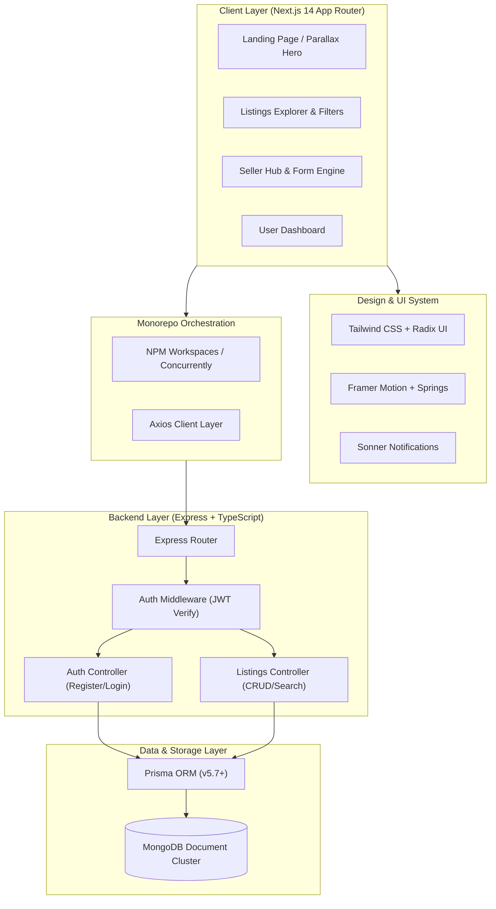

<div align="center">

# ⚡ R E E D U ⚡
### *The Next-Gen Hyper-Fluid Marketplace for Competitive Exam Assets*

[](https://nextjs.org/)
[](https://www.typescriptlang.org/)
[](https://tailwindcss.com/)
[](https://www.framer.com/motion/)
[](https://www.prisma.io/)
[](https://www.mongodb.com/)
[](https://expressjs.com/)
[](https://opensource.org/licenses/MIT)

<p align="center">
  <b>ReEdu</b> transforms how millions of competitive exam aspirants (JEE, NEET, UPSC, GATE, CAT) trade, discover, and recycle top-tier prep materials, eliminating economic barriers through a peer-to-peer circular economy.
</p>

---

[🚀 Quickstart](#-quickstart--local-setup) • [✨ Key Features](#-key-features) • [🏛 Architecture](#-system-architecture) • [📡 API Reference](#-api-endpoints) • [📦 Tech Stack](#-tech-stack-breakdown) • [🛡 Security](#-security--verification)

---

</div>

<br />

## 🌌 The Mission: Democratizing Exam Preparation

Every year, millions of students across the country prepare for high-stakes entrance exams (JEE Advanced, NEET-UG, UPSC CSE, GATE, CAT, CLAT). High-quality modules, test series, and standard references cost thousands of dollars, yet become obsolete to the student the moment the exam ends.

**ReEdu bridges this disconnect:**
- 💸 **80% Cost Reduction** — Buy authenticated, lightly-annotated notes & standard references directly from successful alumni.
- ♻️ **Circular Zero-Waste Campus Culture** — Books circulate across batches instead of gathering dust or ending up in paper mills.
- ⚡ **Zero Middlemen Markups** — Direct peer-to-peer interaction with transparent condition grading and location-based local campus pickups.

---

## ✨ Key Features

```
                                 ┌──────────────────────────────────┐
                                 │       ⚡ REEDU ECOSYSTEM ⚡       │
                                 └──────────────────────────────────┘
                                                  │
                 ┌────────────────────────────────┼────────────────────────────────┐
                 ▼                                ▼                                ▼
    ┌────────────────────────┐       ┌────────────────────────┐       ┌────────────────────────┐
    │  🎨 Cyber-Glass UI/UX  │       │  ⚡ Real-Time Engine   │       │  🔒 Trust & Verification│
    ├────────────────────────┤       ├────────────────────────┤       ├────────────────────────┤
    │ • 4D Parallax Springs  │       │ • Multi-Tag Taxonomy   │       │ • JWT Authentication   │
    │ • Volumetric Glows     │       │ • Instant Query Filter │       │ • Bcrypt Password Hash │
    │ • Neon Nexus Canvas    │       │ • Price Discovery Calc │       │ • Strict Schema Checks │
    │ • Radix UI Primitives  │       │ • MongoDB Document API │       │ • Transparent Profiles │
    └────────────────────────┘       └────────────────────────┘       └────────────────────────┘
```

### 🔮 1. Futuristic 4D Cyber-Glass Interface
- **4D Parallax & Physics Springs**: Smooth cursor-tracking parallax using `framer-motion` springs for an immersive 3D spatial depth.
- **Volumetric Neon Aesthetics**: Custom dark mode palette (`#020205`), cyan (`#00F0FF`) & purple (`#8A2BE2`) glows, and glassmorphism cards with backdrop blurs.
- **Micro-Interactions**: Haptic hover states, glowing CTA buttons, dynamic badges, and fluid layout transitions.

### 📚 2. Advanced Exam-Specific Taxonomy & Search
- **Multi-Exam Categorization**: Filter by **JEE Main/Advanced, NEET, UPSC, GATE, CAT, SSC, State PSCs, Olympiads**.
- **Deep Metadata Indexing**: Search by **Subject**, **Author**, **Publication Edition**, **ISBN**, **Condition Level** (*Brand New, Like New, Lightly Highlighted, Heavy Notes*), and **Campus Location**.
- **Real-Time Dynamic Pricing**: Instant comparison against market MRP to highlight true student savings.

### 💼 3. Frictionless Seller Terminal
- **Rapid Listing Creation**: Upload book details, condition tags, target exams, physical location, and media in seconds.
- **Seller Dashboard**: Manage live assets, track view interest, update pricing, and mark listings as sold.
- **Campus Exchange Proximity**: Coordinate local campus handoffs or direct courier shipping with ease.

### 🛡️ 4. Enterprise-Grade Security & Monorepo Scale
- **Dual-Engine Workspace**: Clean separation of Next.js 14 Frontend and TypeScript Express Backend via npm workspaces.
- **Prisma + MongoDB**: Scalable document-oriented schema with type-safe database queries.
- **Robust Auth Barrier**: Stateless JWT sessions with salted Bcrypt hashing.

---

## 🏛 System Architecture



---

## 📦 Tech Stack Breakdown

### Frontend
| Technology | Description | Badge |
| :--- | :--- | :--- |
| **Next.js 14** | React Framework with App Router & SSR | `v14.2.33` |
| **React 18** | UI Library & Hooks | `v18.2.0` |
| **TypeScript** | Type Safety & Developer Experience | `v5.2+` |
| **Framer Motion** | Complex 4D Parallax & Physics Animations | `v12.23+` |
| **Tailwind CSS** | Utility-First Modern Cyberpunk Theme | `v3.3.3` |
| **Radix UI** | Accessible Unstyled Component Primitives | `@radix-ui/*` |
| **Lucide Icons** | Pixel-perfect Vector Iconography | `v0.446+` |

### Backend & Database
| Technology | Description | Badge |
| :--- | :--- | :--- |
| **Node.js + Express** | High-Throughput RESTful API Engine | `v4.19+` |
| **Prisma ORM** | Next-generation Node.js & TypeScript ORM | `v5.7.1` |
| **MongoDB Atlas** | Scalable NoSQL Document Database | `v7.0+` |
| **JWT & Bcrypt.js** | Stateless Token Auth & Salted Hashing | `v9.0 / v3.0` |
| **Nodemon + TS-Node**| Hot-Reloading Development Environment | `v3.1 / v10.9` |

---

## 📂 Repository Blueprint

```text
reedu-monorepo/
├── apps/
│   ├── backend/                     # 🛡️ REST API Server (Express + TypeScript)
│   │   ├── src/
│   │   │   ├── controllers/         # Business logic (auth, listings)
│   │   │   │   ├── auth.controller.ts
│   │   │   │   └── listings.controller.ts
│   │   │   ├── middlewares/         # JWT verification & guards
│   │   │   │   └── auth.middleware.ts
│   │   │   ├── routes/              # Express API Routes
│   │   │   │   ├── auth.routes.ts
│   │   │   │   └── listings.routes.ts
│   │   │   ├── utils/               # Prisma singleton client
│   │   │   │   └── prisma.ts
│   │   │   └── index.ts             # Express server entry point
│   │   ├── package.json
│   │   └── tsconfig.json
│   │
│   └── frontend/                    # 🎨 Client Web Application (Next.js 14)
│       ├── app/                     # App Router pages & layouts
│       │   ├── dashboard/           # User dashboard (My Listings)
│       │   ├── listings/            # Marketplace discovery & details [id]
│       │   ├── login/               # Auth sign-in
│       │   ├── register/            # Auth sign-up
│       │   ├── sell/                # Listing creation wizard
│       │   ├── globals.css          # Global styling & glow utilities
│       │   ├── layout.tsx           # Root layout with fonts & providers
│       │   └── page.tsx             # 4D Parallax Landing Page
│       ├── components/
│       │   ├── layout/              # Navbar, Footer, Containers
│       │   ├── ui/                  # NeonButton, GlassCard, NeonNexus, etc.
│       │   └── providers/           # Theme & Context Providers
│       ├── lib/                     # Client utilities & Axios instance
│       ├── package.json
│       └── tailwind.config.ts
│
├── prisma/
│   └── schema.prisma                # Database models (User, Listing)
├── package.json                     # Monorepo root workspace orchestrator
└── README.md                        # Documentation
```

---

## 🚀 Quickstart & Local Setup

### 1️⃣ Prerequisites
Ensure you have the following installed:
- [Node.js](https://nodejs.org/) `>= 18.x.x`
- [npm](https://www.npmjs.com/) `>= 9.x.x`
- [MongoDB](https://www.mongodb.com/try/download/community) local instance or a free [MongoDB Atlas Cluster](https://www.mongodb.com/atlas)

### 2️⃣ Clone Repository & Install Dependencies
```bash
# Clone the repository
git clone https://github.com/mittalshivam226/REEDU---Fullstack-Project.git
cd REEDU---Fullstack-Project

# Install all monorepo dependencies in one go
npm install
```

### 3️⃣ Configure Environment Variables
Create a `.env` file in the project root (and in `apps/backend/.env` / `apps/frontend/.env.local` if needed):

```env
# Database Connection (MongoDB Connection String)
DATABASE_URL="mongodb+srv://<username>:<password>@cluster0.mongodb.net/reedu_db?retryWrites=true&w=majority"

# Backend Authentication Secret
JWT_SECRET="your_ultra_secure_neon_jwt_secret_key_2026"
PORT=5000

# Frontend API Target
NEXT_PUBLIC_API_URL="http://localhost:5000/api"
```

### 4️⃣ Generate Prisma Client & Sync Database
```bash
# Generate the Prisma Client for MongoDB
npx prisma generate

# (Optional) Open Prisma Studio GUI
npx prisma studio
```

### 5️⃣ Launch the Full-Stack Dev Engine
Start both Frontend (`http://localhost:3000`) and Backend (`http://localhost:5000`) concurrently with a single command:

```bash
npm run dev
```

> **Target Ports**:
> - 🌐 **Frontend**: `http://localhost:3000`
> - ⚡ **Backend API**: `http://localhost:5000`
> - 🗄️ **Prisma Studio**: `http://localhost:5555` *(via `npx prisma studio`)*

---

## 📡 API Endpoints

### 🔐 Authentication (`/api/auth`)
| Method | Endpoint | Description | Protected |
| :--- | :--- | :--- | :---: |
| `POST` | `/api/auth/register` | Create a new student account | ❌ |
| `POST` | `/api/auth/login` | Authenticate user & receive JWT token | ❌ |

#### Example: Register Payload
```json
{
  "name": "Shivam Mittal",
  "email": "shivam@example.com",
  "password": "StrongPassword123"
}
```

---

### 📖 Listings (`/api/listings`)
| Method | Endpoint | Description | Protected |
| :--- | :--- | :--- | :---: |
| `GET` | `/api/listings` | Fetch all active book listings | ❌ |
| `GET` | `/api/listings/:id` | Fetch specific book by MongoDB ID | ❌ |
| `POST` | `/api/listings` | Create a new book listing | ✅ *(Bearer Token)* |
| `GET` | `/api/listings/user/me` | Fetch all listings created by logged-in user | ✅ *(Bearer Token)* |

#### Example: Create Listing Payload
```json
{
  "title": "Concepts of Physics (Vol 1 & 2) - H.C. Verma",
  "description": "Complete mechanics and thermodynamics set. Minor pencil marks, otherwise pristine condition.",
  "price": 450,
  "condition": "Like New",
  "location": "North Campus, Delhi",
  "tags": ["JEE Advanced", "Physics", "Mechanics", "11th Grade"],
  "edition": "2024 Revised Edition",
  "isbn": "978-8177091878",
  "images": [
    "https://images.unsplash.com/photo-1544716278-ca5e3f4abd8c"
  ]
}
```

---

## 🗄 Database Schema (Prisma / MongoDB)

```prisma
model User {
  id        String    @id @default(auto()) @map("_id") @db.ObjectId
  email     String    @unique
  password  String
  name      String
  role      String    @default("USER")
  createdAt DateTime  @default(now())
  updatedAt DateTime  @updatedAt
  listings  Listing[]
}

model Listing {
  id          String   @id @default(auto()) @map("_id") @db.ObjectId
  title       String
  description String?
  price       Float
  condition   String
  location    String
  tags        String[]
  edition     String?
  isbn        String?
  images      String[]
  userId      String   @db.ObjectId
  user        User     @relation(fields: [userId], references: [id], onDelete: Cascade)
  createdAt   DateTime @default(now())
  updatedAt   DateTime @updatedAt
}
```

---

## 🎯 Supported Exam Verticals

<table>
  <tr>
    <td align="center" width="20%">
      <b>🚀 Engineering</b><br/>
      <small>JEE Main • JEE Advanced • BITSAT • GATE • VITEEE</small>
    </td>
    <td align="center" width="20%">
      <b>🩺 Medical</b><br/>
      <small>NEET-UG • AIIMS Archives • NEET-PG • USMLE Step 1</small>
    </td>
    <td align="center" width="20%">
      <b>🏛 Civil Services</b><br/>
      <small>UPSC CSE • State PSCs • SSC CGL • CDS • NDA</small>
    </td>
    <td align="center" width="20%">
      <b>📈 Management & Law</b><br/>
      <small>CAT • XAT • GMAT • CLAT • AILET</small>
    </td>
    <td align="center" width="20%">
      <b>🔬 Science & Others</b><br/>
      <small>CSIR-NET • IIT JAM • Olympiads • CBSE 10/12 Boards</small>
    </td>
  </tr>
</table>

---

## 🤝 Contributing

Contributions are what make the open-source community such an amazing place to learn, inspire, and create. Any contributions you make are **greatly appreciated**.

1. **Fork** the Project
2. Create your Feature Branch (`git checkout -b feature/AmazingFeature`)
3. Commit your Changes (`git commit -m 'Add some AmazingFeature'`)
4. Push to the Branch (`git push origin feature/AmazingFeature`)
5. Open a **Pull Request**

---

## 📄 License

Distributed under the **MIT License**. See `LICENSE` for more information.

---

<div align="center">

Made with ⚡ by **[Shivam Mittal](https://github.com/mittalshivam226)** & Contributors

<sub>ReEdu © 2026 — Powering the Future of Affordable Student Learning.</sub>

</div>